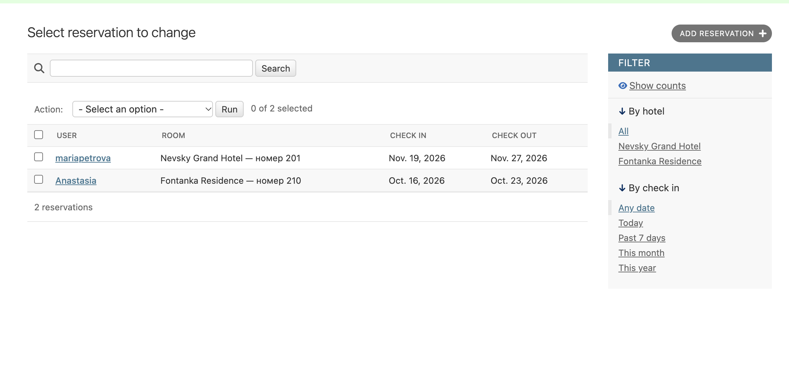
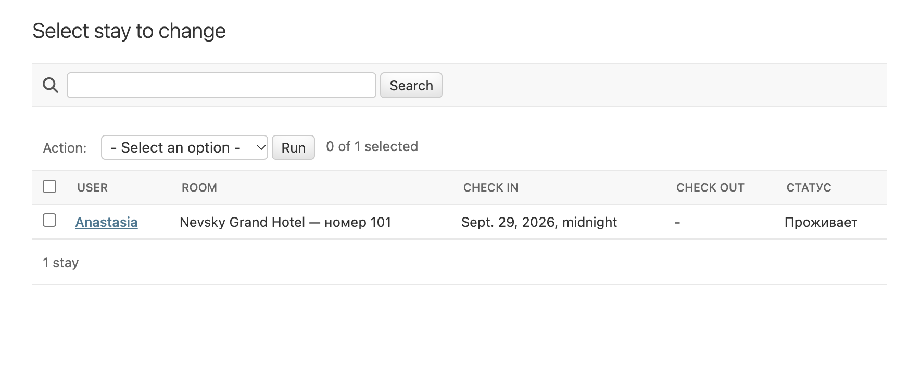

# Работа администратора

## Django Admin

Административная часть доступна по адресу `/admin/`. В ней зарегистрированы `Hotel`, `RoomType`, `Amenity`, `Room`, `Reservation`, `Review` и `Stay`. Доступ к данным зависит от прав аккаунта. Суперпользователь может управлять всеми этими записями.

В списке бронирований показаны пользователь, номер и даты. Есть поиск по имени пользователя и номеру комнаты, а также фильтры по отелю и дате заезда.

Сценарий заселения:

1. Пользователь создаёт бронирование на сайте.
2. Администратор открывает список `Reservation`.
3. Отмечает нужную запись.
4. Выбирает действие «Заселить» (`check_in_guests`) и запускает его.
5. Создаётся запись `Stay` с пользователем и номером из бронирования. Время заселения устанавливается на 00:00 даты заезда.

Если для этого пользователя и номера уже есть незавершённое проживание или запись с тем же временем заезда, действие пропускает бронирование. Существующая запись не обновляется.

Для выселения администратор открывает список `Stay`, отмечает проживание и выбирает «Выселить» (`check_out_guests`). У незавершённых проживаний, которые уже начались, `check_out` получает текущую дату и время. Уже завершённые записи не меняются.

В списке `Stay` виден статус «Проживает» или «Завершено». Можно искать по имени пользователя и номеру комнаты, фильтровать по номеру, отелю, дате заселения и наличию даты выселения.

*Рисунок 6 — Бронирования в Django Admin*

*Рисунок 7 — Проживания в Django Admin*

## Разграничение прав в клиентской части

Просмотр номеров доступен без входа. Для бронирования, отзывов и управления своими бронированиями нужен вход в аккаунт.

Ссылка «Постояльцы» в `base.html` показана только при `user.is_staff`. Представление `recent_guests` также проверяет этот признак. При прямом переходе обычного пользователя на `/guests/` он возвращается к списку номеров.
