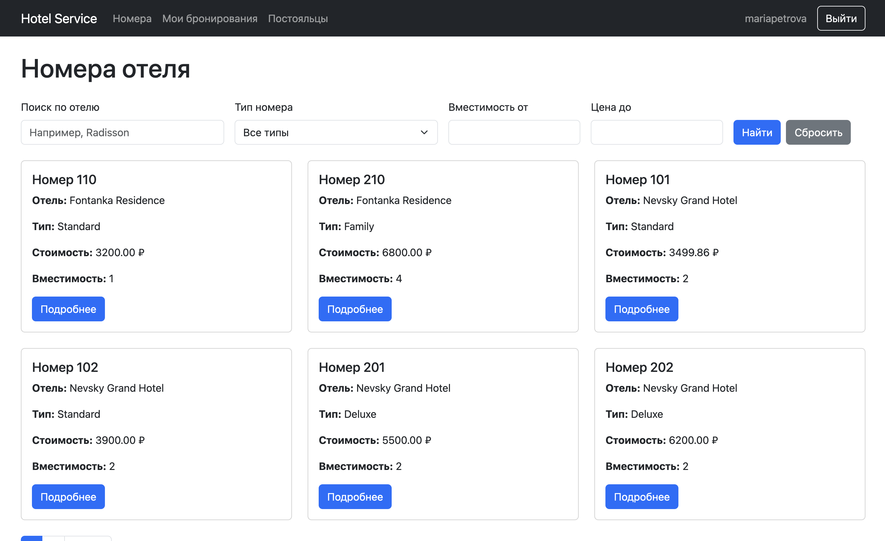
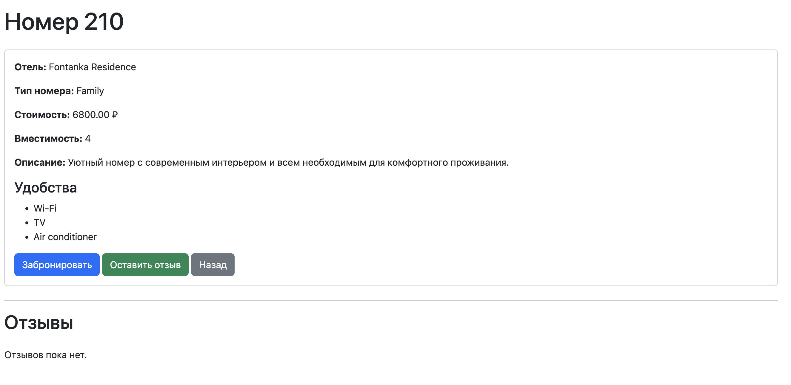
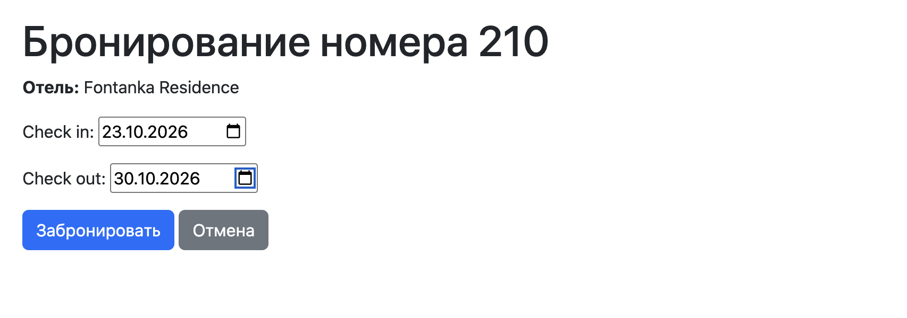
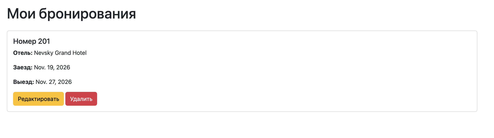
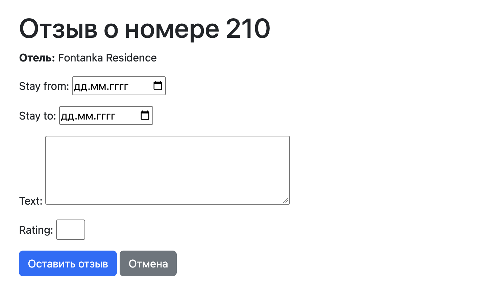

# Интерфейс сайта

В оформлении используется Bootstrap 5.3.3. Он подключён через CDN в `base.html`. На страницах есть общая панель навигации, карточки номеров, кнопки, формы и таблица.

Ниже приведены скриншоты интерфейса сайта.

## Список номеров

Главная страница `/` показывает карточки номеров. Вверху находятся поиск по названию отеля и фильтры. Внизу — переход между страницами.

*Рисунок 1 — Список номеров, поиск и фильтрация*

## Страница номера

По адресу `/room/<room_id>/` видны отель, тип, цена, вместимость, описание, удобства и отзывы. Пользователь после входа может перейти к бронированию или добавлению отзыва.

*Рисунок 2 — Страница номера*

## Форма бронирования

Страница `/room/<room_id>/reserve/` содержит поля дат заезда и выезда. Ошибки дат и пересечений выводятся на этой же форме. При редактировании она показывает сохранённые даты.

*Рисунок 3 — Форма бронирования*

## Мои бронирования

На странице `/reservations/` пользователь видит свои бронирования и ссылки для редактирования и удаления. Перед удалением открывается страница подтверждения.

*Рисунок 4 — Мои бронирования*

## Форма отзыва

Страница `/room/<room_id>/review/` содержит даты проживания, текст и рейтинг. После сохранения отзыв появляется на странице номера.

*Рисунок 5 — Форма добавления отзыва*

## Таблица постояльцев

На странице `/guests/` сотрудник видит пользователя, отель, номер, даты заселения и выселения, а также статус «Проживает» или «Выселен».

*Место для скриншота: `images/guests.png` — таблица постояльцев.*

<!--  -->

## Регистрация и вход

Регистрация находится по адресу `/register/`, вход — `/accounts/login/`. После входа в меню появляются имя пользователя, «Мои бронирования» и кнопка выхода. У сотрудника также появляется ссылка «Постояльцы».
